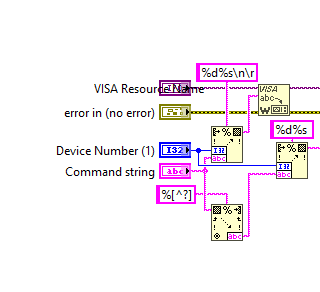
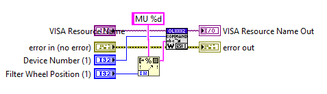
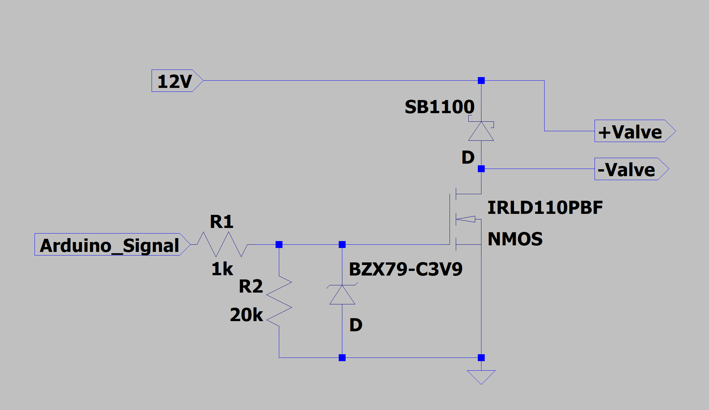

# Labview Integration Software

Integration software for the following devices:
- Olympus IX81
- Maerzhäuser TANGO X-Y-Stage Controller
- SOLA Light Engine
- ANDOR iXon3-888 DU8201_BV (Controller CCI-20)
- A custom made 24-valve controller, based on an Arduino Mega 2560
- __TODO:__ Elveflow OB1 Pressure Controller

## Provided functionalities
+ Microsocope Actuation:
  + Light Source Intensity
  + Exposure Time Adjustment
  + Filter
  + Prism (Camera/Ocular)
  + Focus
  + Stage Control
    + Calibration
    + Waypoint Acquisition
    + Waypoint XML-Export
+ Image Acquisition
  + Live Image Mode
  + Single Image Acquisition and Export to multiple formats
  + Histogram Analysis and Adjustment
+ Valve Operation
  + manual single valve actuation
  + for the purpose of microfluidic single and multiring reactors:
    + Dilution (_Feed_)
    + Mixing (_Pump_)
    + Usage of (up to 8) different Reactants (_Flush_)
    + Calibration of exchanged volume fraction by dilution
+ Execution of custom microscopy programs
  + Import/Export of microscope settings and waypoints
  + Programming of custom schedules
    + Pump (Duration, Frequency)
    + Feed (Ratio)
    + Change Reagent (Duration, Reagent Number)
    + Incubate (Duration)
    + Acquire Images 
    + Loop Program Parts (Loop ID, Iteration Count)

## Neccessary packages and settings
The software has been designed in LabView 2018 32-bit or higher with the following packages and tools installed:
- Labview 2018 32-bit or higher

Via _NI Package Manager_:
- JKI VI Package Manager
- NI Vision Acquisition Software 19.5
- NI-Vision Development Module (2018 or 18.5.1), which includes also
  - NI IMAQ(/dx) for LV2018
  - NI Vision Assistant
- NI MathScript RT Module
- NI-DAQ (15.01)
- NI-IMAQ (19.0.0)
- NI-Vision (2018)
- NI-Serial (18.5)
- NI-VISA (complete)

Via _VI Package Manager_:
- Makerhub Toolbox (V 2.0.0.35)
- Diligent LINX (V 3.0.1.1.92)

## Open ToDos

### CRUCIAL

- Adjust Focus Button to Limits
  -  Calculate Limits for every objective
  - Limit Olympus Objective Movement
- Merge Program Loop into main loop
- Update State Display
- __Remove Air Button__
	- Close B5, open Channel, "open all"
- Return single valve states after execution:
	- [ ] Feed
	- [ ] Pump
	- [ ] Load
	- [ ] Close
	- [ ] Open
	- [ ] Flush
	- [ ] Remove Air
- Review calibration timing
- Update single Position (replace operation)
- Run program with current settings per default
- Let "Remaining Time" count down
- Test Program procedure
- Review Time Calculation procedure 
  + Transfer Timing and Process Finish Events/Handlers 


### PRIO0

- Handle the Camera Events properly (Performance enhancing):
  - Make a dynamic event (LV)
  - register it (LV)
  - Make an event case for it (LV)
  - Then, create the event handle (dll) and start a dynamic vi (LV) that waits for it (dll)
  - When it's done, trigger the event (generate user event).


### PRIO1
- Adjust Jogsens with objective
- Limit z-Movement with Objective
- Microscope Buttons
- Better focus control (maybe a slider?)
- Dokumentation

### PRIO2

### IDEA
- Correct PDMS angle in camera pictures and implement it also in the Stage movement


## Initial API Package Configuration
Generally, every library can be configured standalone from the _lib_ folder of the project. Instructions for every API are supplied in the respective folder. In the following, several basic fixes for common bugs as well as usage hints with the project are explained.

Maybe it is neccessary to use the "Import .dll" function to get the libraries loaded correctly. (go to Tools>Import>Shared Library (.dll))
- How to load a dynamically linked library (dll) correctly? (this could be necessary for SOLA, ANDOR and TANGO)
- An importable dll consists of a precompiled library (.dll) and a (C/++) header (.h) file.
- Specify the corresponding paths in the Github project at first. ("Full Path to Repo\lib\instrument\...)
- Copy-Paste the preprocessor definitions from the instrument folder
- Follow any further instructions
- In case the VIs are not visible on the palette, go to Tools>Advanced>Edit Palette Set and select the missing ones

### Olympus IX 81 Control
In order to work with the LabView package, the library and the IX81 successfully, configure the SubVI _Olympus Command.vi_ to terminate with ```\n\r```. Append ASCII text termination Carriage Return and Line Feed to the  communication string for successful connection.



Further, change the __filter-change-command__ in the SubVI _Select_ _Filter_ _Wheel.vi_ from "FW" to "MU".


- Find the SubVIs in the Instrument Menu
- Only use the IX SubVIs (Text on symbol)
- 
### Initialization

- Bright Field Lamp Configuration
  - SubVI: __Lamp_Conf__
    - Params: Double intensity (Voltage between 0 and 12V)
- Shutter
  - SubVI: __Status__
    - Params: Bool Shutter State (CAVE: Normally Closed)
- Objective Selection
  - SubVI: __Objective__
      - Params: Enum Objective
- Prism Configuration
  - Light path through both oculars or beam splitting for camera path
  - SubVI: __Prism__
    - Params: Enum Prism Position
- Filter Selection
  - SubVI: __Filter__ __IX__
    - Params: Enum Filter Wheel Position
- Focus / Autofocus (Objective z-Axis)
  - @@@ TODO
	
### Termination
- Reset Lamp to 0V or Disabled
- Logout every Login you performed (e.g. for each device number 1 and 2 a sequential logut is necessary)
- Close VISA connection


 
## TANGO Stage XY-Control

### Configuration:

Import _Tango.dll_ and header file via the __Import Shared Library__ function. Copy paste the preprocessor definitions from `lib/TANGO Stage/SubVIs/preprocessor_definitions.txt`
The following preprocessor definitions are essential:
```c
#ifndef _TANGOLSXAPI_INCLUDED_;
#define _TANGOLSXAPI_INCLUDED_;
#define TANGOAPI __declspec (dllimport);
#define TANGOCALL __stdcall;
#pragma pack(1);
```

 
## SOLA Light Control

Acquired the LabView library form Lumencor support.

 

## ANDOR Camera

Imported the C/C++ functions via the __Import Shared Library__ function with the preprocessor definition sepecified in the _lib/ANDOR_ folder.´The original library ```atmcd32d.llb```has been downloaded from GitHub. 
### Usage
- quite good Documentation under _lib/ANDOR_
- Labview Error Handling has to be supplied via the function return values


## Custom Arduino-Valve-Controller
The Valve Controller consists of the following components:
- Arduino Mega 2560 Rev 3
- Custom Hole Raster Board for Current Amplification and Protection
- Festo valve manifolds
    ```
    2x MH1-A-12VDC-N-TC-8V-PR-K05-QB-AD-BD-CX-DX
    1x MH1-A-12VDC-N-TC-5V-PR-K05-QB-AD-BD-CX-DX
    1x MH1-A-12VDC-N-TC-3V-PR-K05-QB-AD-BD-CX-DX
    manual pressure regulators MS4-LR-1/4-D5-AS
    ```
- 230V - 12V Power Adapter
- PC with LabView 2013 x86 (32-bit) or higher!

### Amplification/Protection Board Layout

- Driver for a single Valve, 24 parallel on Board
- Input: Arduino Digital Signal (5V:high,0V:low, Blue Cables), 12 V
- Output: Valve Connections (Grey Cables)
- Ground must be common with Arduino (Black Pins)



### LabView + Arduino Mega 2560 Setup
#### For older versions

- Install LINX preferably from the NI Package Manager or from this source.(Very few) Documentation can be found under: https://www.labviewmakerhub.com/doku.php?id=libraries:linx:start
- Follow the installation instructions and restart the PC
- Browse into the LINX folder of your installation (similar to C:\Program Files (x86)\National Instruments\LabVIEW 2013\vi.lib\LabVIEW Hacker\LINX\Firmware\Source\Arduino\LINX_Arduino_Base_Firmware)
- Open Linx Arduino Source File (LINX.cpp)
- Go to LINX_Config.h
- Uncomment the lines for the correct Chipset and disable all others
- Flash LINX software to arduino

#### For newer versions

- Install the Makerhub Toolbox and Diligent LINX (in this order) from the _JKI Package Manager_
- Select in LabView __Tools__ > __Makerhub__ > __LINX Firmware Wizard__
- Follow the instructions for an Arduino Mega2560 via USB/Serial connection
 
### LabView LINX Command (with LINX SubVIs) Workflow:
VISA Ressource Name: COM Port of USB-connection to Arduino (see Windows Device Manager if you are unsure)
``` c
[Initialized VISA Ressource, Error Out] = Initialize.vi (VISA Ressource Name, Error In]
[Initialized VISA Ressource, Error Out] = DigitalWriteNChans.vi(Initialized VISA Ressource, Bool Valve_State[n], Integer Pin_Numbers[n])
[Error Out] = Close.vi(Initialized VISA Ressource, Error In)
```

